# Tomcat 就是这么简单


## 什么是Tomcat

Tomcat简单的说就是一个运行JAVA的网络服务器，底层是Socket的一个程序，它也是JSP和Serlvet的一个容器。

## 为什么我们需要用到Tomcat

如果你学过html，css，你会知道你写的页面只能自己访问，**别人不能远程访问你写的页面**，Tomcat就是**提供能够让别人访问自己写的页面的一个程序**


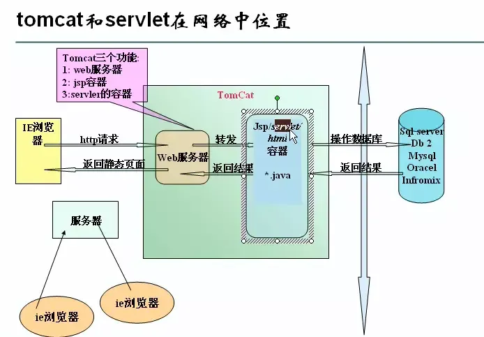


## 配置Tomcat

运行Tomcat需要JDK的支持【Tomcat会通过JAVA_HOME找到所需要的JDK】。

- **新建JAVA_HOME环境变量**【路径是JDK的主目录】


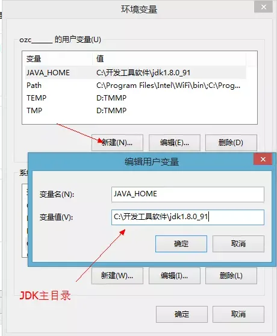


- **进入Tomcat目录下的bin中启动startup.bat**，以下是成功启动Tomcat的页面。

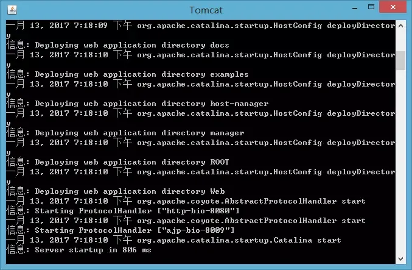


- 在浏览器地址栏输入http://localhost:8080,如果**能够出现Tomcat页面，说明配置成功了**！

**注意：如果在使用Tomcat时出现了`Error deploying web application directory web222`,很大原因就是jdk和tomcat的版本不匹配。目前，jdk8不能匹配tomcat7.0，所以要降低jdk版本**【换成JDK7】

当然也有可能不是一帆风顺能够直接启动Tomcat，**不能正常启动Tomcat会有以下情况**

1. JAVA_HOME配置错误
2. 端口被占用了

- 第一种方法：在cmd输入netstat -anb查看谁占用了该端口【Tomcat默认的是8080】,在进程中关闭它
- 第二种方法：主动改变tomcat的端口, **到tomcat主目录下的conf/server.xml文件中修改**,把8080端口改成是8088或者是其他的‘

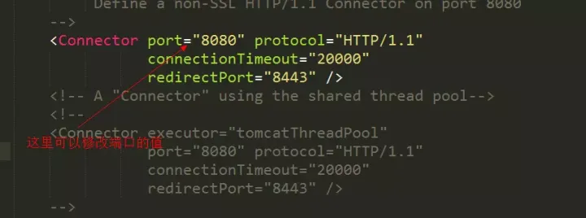


## 相关术语介绍


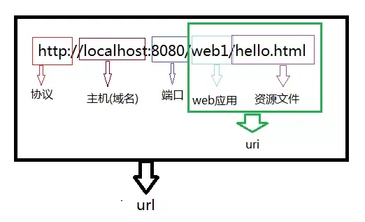


## tomcat结构目录


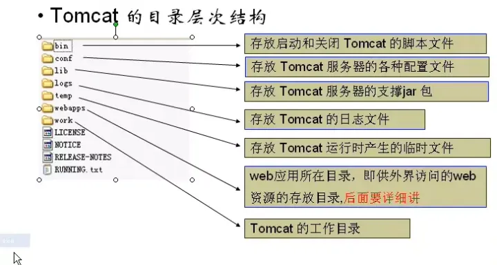


## 目录的简单介绍

1. bin：启动和关闭tomcat的bat文件
2. conf：配置文件

- `server.xml`该文件用于配置server相关的信息，比如tomcat启动的端口号，配置主机(Host)
- `web.xml`文件配置与web应用（web应用相当于一个web站点）
- `tomcat-user.xml`配置用户名密码和相关权限.


1. lib：该目录放置运行tomcat运行需要的jar包
2. logs：存放日志，当我们需要查看日志的时候，可以查询信息
3. webapps：放置我们的web应用
4. work工作目录：该目录用于存放**jsp被访问后生成对应的server文件和.class文件**

## webapps目录的详细说明

**在webapps中建立了web1目录**，下面放置我们的html文件，jsp文件，图片等等，**则web1就被当做web应用管理起来**【tomcat6.0以后的版本才支持】

例子：**在webapps下创建一个web站点，在web站点下创建一个html文件，访问html文件**


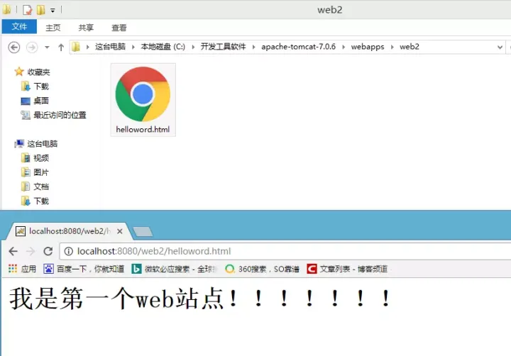


**web站点的目录是有规范的**


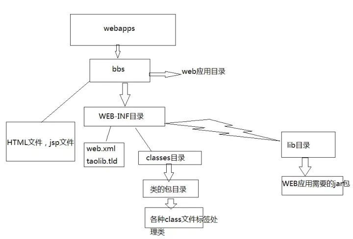


为什么要这样设置web站点目录呢？

- 需求：我有多个html文件，想把其中的一个html文件作为我web站点的首页。
- 如果**没有WEB-INF目录下的web.xml文件支持，是无法解决我的需求的**
- **这个规范是约定熟成的。**

下面将web站点下的helloword2.xml文件作为站点的首页

- 新建一个WEB-INF目录


- 在WEB-INF目录下创建一个web.xml


- web.xml我们不可能会写，所以可以**在webapps目录下其他的站点中抄一份过来**【复制ROOT/WEB-INF/web.xml的文件到自己的站点中】
- 在web.xml中添加以下代码

```text
	  <welcome-file-list>
	        <welcome-file>helloword2.html</welcome-file>
	  </welcome-file-list>
```


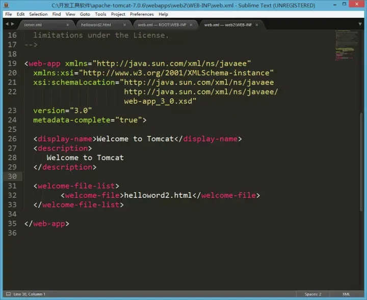


- 访问web站点【**helloword2.html已经是web站点的首页了，所以不需要指定资源访问了**】


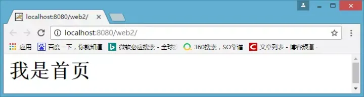


## 配置虚拟目录

## 为什么需要配置虚拟目录？

- 如果把所有web站点的目录都放在webapps下，可能导致**磁盘空间不够用**，也**不利于对web站点目录的管理**【如果存在非常多的web站点目录】
- 把**web站点的目录分散到其他磁盘管理就需要配置虚拟目录【默认情况下，只有webapps下的目录才能被Tomcat自动管理成一个web站点】**
- 把web应用所在目录交给web服务器管理，这个过程称之为虚拟目录的映射

## 配置虚拟目录方法一：

- 在其他盘符下创建一个web站点目录，并创建WEB-INF目录和一个html文件。


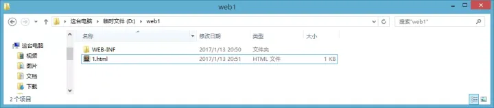


- 找到Tomcat目录下/conf/server.xml文件


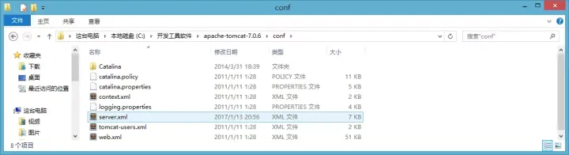


- 在server.xml中的节点下添加如下代码。**path表示的是访问时输入的web项目名，docBase表示的是站点目录的绝对路径**

```text
		<Context path="/web1" docBase="D:\web1"/>
```


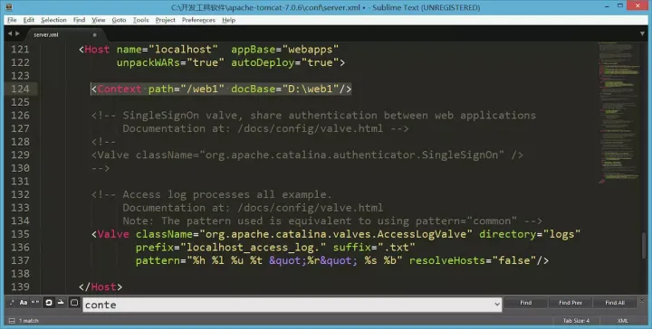


- 访问配置好的web站点


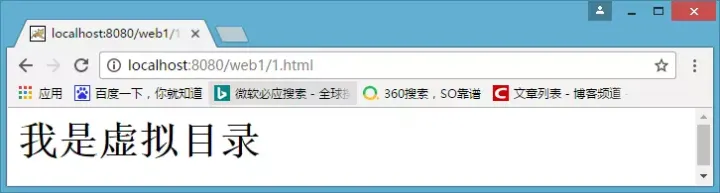


## 配置虚拟目录方法二：

- 进入到conf\Catalina\localhost文件下，创建一个xml文件，**该文件的名字就是站点的名字。**

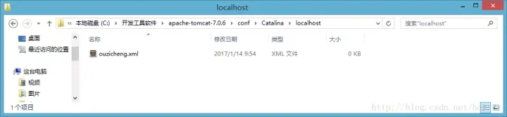


- xml文件的代码如下，**docBase是你web站点的绝对路径**

```text
<?xml version="1.0" encoding="UTF-8"?> 
<Context 
    docBase="D:\web1" 
    reloadable="true"> 
</Context> 
```

- 访问web站点下的html资源

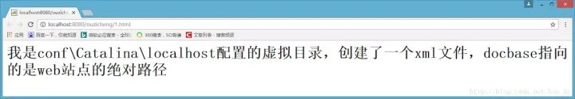


## 配置临时域名

访问Tomcat服务器有好几种方式

- 使用localhost域名访问【localhost代表本机】
- 使用ip地址127.0.0.1访问【该ip地址也是本机】
- 使用机器名称访问【只限用于本机上或者局域网】
- 使用本机IP地址访问【**在cmd中输入ipconfig可以查询到本机IP地址**】
- 还可以为机器配置临时域名

## 配置临时域名步骤

- 打开到C:\Windows\System32\drivers\etc下，找到hosts文件


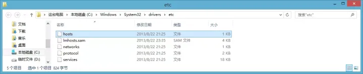


- 在hosts文件下配置临时域名


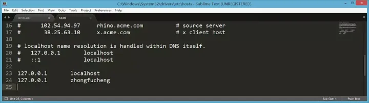


## 设置虚拟主机

## 什么是虚拟主机？

**多个不同域名的网站共存于一个Tomcat中**

## 为什么需要用到虚拟主机？

例子：我现在开发了4个网站，有4个域名。如果我不配置虚拟主机，一个Tomcat服务器运行一个网站，我就需要4台电脑才能把4个网站运行起来。

## 配置虚拟主机的步骤

- 在tomcat的server.xml文件中添加主机名

```text
	  <Host name="zhongfucheng" appBase="D:\web1">
					<Context path="/web1" docBase="D:\web1"/>
	  </Host>
```


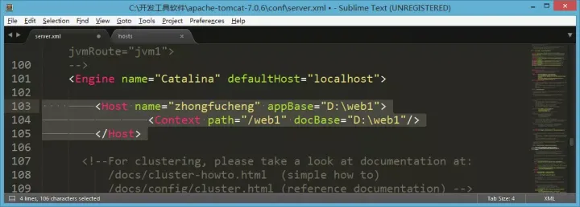


- 访问虚拟主机下的web站点

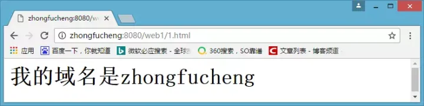


## Tomcat体系结构


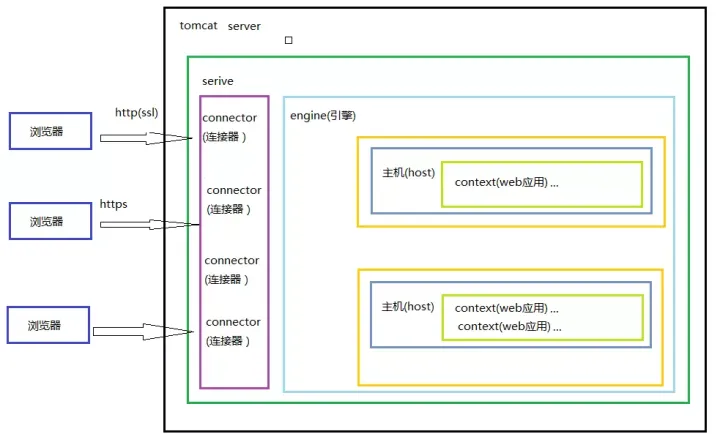


## 浏览器访问WEB资源的流程图


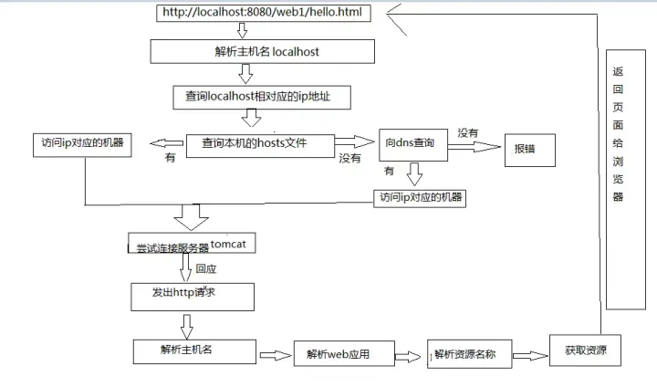


## 练习

在浏览器输入http//:zhongfucheng直接显示到页面

分析：

1. 需要配置虚拟主机
2. 把8080端口改成80
3. 设置web站点首页
4. 映射虚拟目录为/


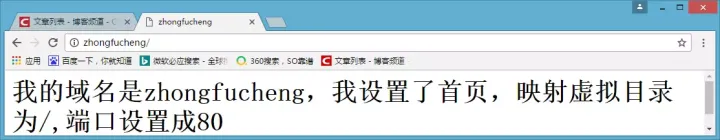


> 如果文章有错的地方欢迎指正，大家互相交流。习惯在微信看技术文章的同学，可以关注微信公众号:Java3y

编辑于 2018-02-03 21:11